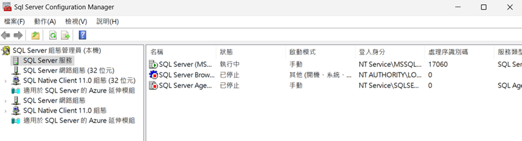
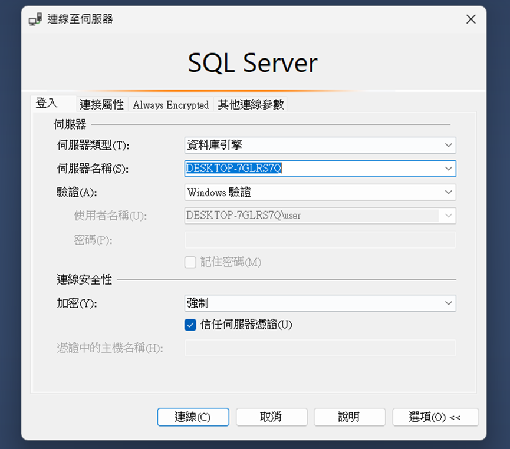
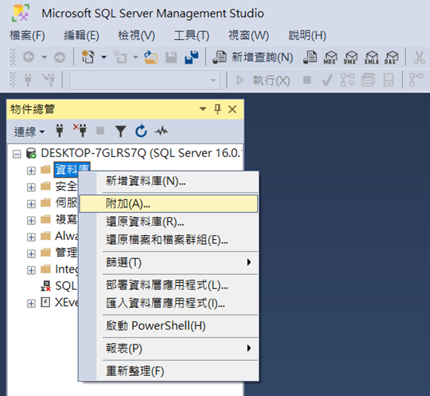
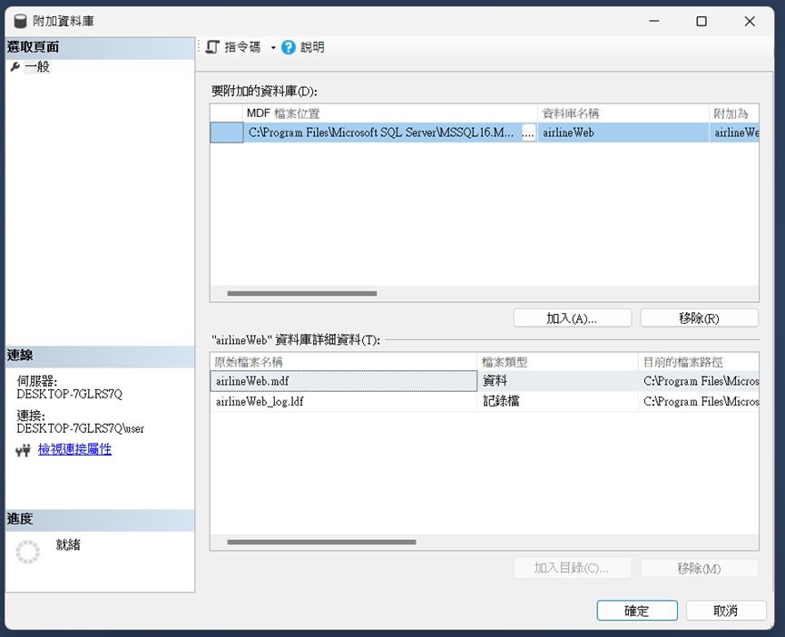

# Airline Web

## Introduction
This project, "Airline Web," serves as a hands-on learning experience in database management and web development. The website is built using Flask, a lightweight web framework in Python, and is integrated with Microsoft SQL Server for the database backend. Through this project, I aim to demonstrate and apply the concepts and techniques I've learned during my studies of databases.

## Installation and Setup
1. **Download and Install Python**:
   - [Download Python](https://www.python.org/downloads/) from the official website.
   - Follow the instructions to install Python on your system.
   - Ensure that `pip` is also installed. You can verify this by running the following command in your terminal:
    ```bash
    python -m pip --version
    ```
   - Install the required Python packages by running:
    ```bash
    pip install flask pyodbc
    ```

2. **Download and Install Microsoft SQL Server Developer Edition**:
    - [Download Microsoft SQL Server Developer Edition](https://www.microsoft.com/zh-tw/sql-server/sql-server-downloads) from the official Microsoft website.
    - Follow the setup instructions to install SQL Server on your machine.
    - After finished installation of SQL server, click the button below, install SQL Server Management Studio (SSMS) to manage your database with a graphical interface.

3. **Checking and connecting**
    - Open Sql Server Configuration Manager to check if server is activating
    
    - Open SSMS to connect to database
    
    - Insert the database I provided in this repo(you can extract files to "Microsoft SQL Server\MSSQLXX.<InstanceName>\MSSQL\DATA" at first, you will easily find it)
    
    

## Usage
1. Run the Application:
   - Execute `app.py` to start the web application.
   
2. Sign In:
   - You can sign in using one of the following modes:
   
    **User Mode:**
    - Account: `mia`
    - Password: `mia`
    
    **Admin Mode:**
    - Account: `admin`
    - Password: `admin`

## Features
### User Mode
The User Mode allows visitors to perform the following actions:

- **Search Flights**: Users can enter information such as departure city, destination, departure date, etc., to find suitable flight options.
- **Select Flights**: Users can view a list of available flights and choose the options they prefer.
- **Book Tickets**: Users can add selected tickets to their cart and proceed to checkout.
- **Checkout**: Users can provide necessary personal and payment information to confirm their orders.
- **View Orders**: Users can view their past order history, including order details and payment status.

### Admin Mode
The Admin Mode allows privileged users to perform the following actions:

- **Manage Flight Information**: Admins can add, edit, or delete flight information, including flight numbers, dates, times, seat availability, etc.
- **View Orders**: Admins can view all orders, including user information, order status, and payment details.
- **Process Orders**: Admins can update the status of orders, such as confirming payment, sending e-tickets, etc.
- **Manage Users**: Admins can view and manage user accounts, including adding or removing users, resetting passwords, and viewing user order history.

### Demo Viedo
[Demo](https://youtu.be/yrakHqfjz24)